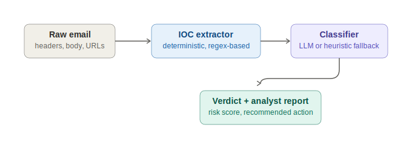

# Phishing Triage API

A small SOC-analyst tool that takes a raw email and returns a risk verdict, extracted indicators of compromise, and a ready-to-paste analyst report, in seconds instead of the several minutes it takes to do the same triage by hand.

I built this after spending a lot of my week investigating phishing reports manually: pulling the sender domain, checking for lookalike spoofing, scanning for urgency/credential-harvest language, and writing up a summary for the ticket. This automates the first pass of that workflow using an LLM (OpenAI) grounded on deterministic, explainable static analysis, with a pure heuristic mode that keeps it fully usable with no API key or cost.



## Why it's built this way

**Static analysis runs first, always.** `app/ioc_extractor.py` extracts URLs, IPs, sender domain, display-name spoofing, leetspeak lookalike domains (`micros0ft-secure-login.xyz` → flagged as impersonating `microsoft`), urgency language, and credential-harvesting language, all with plain regex and string matching. This is fast, free, fully explainable, and never depends on a third-party API being up.

**The LLM reasons over that evidence, not raw text.** When `OPENAI_API_KEY` is set, the extracted IOCs are passed into the prompt as grounding facts alongside the raw email, so the model is scoring evidence rather than guessing from scratch.

**It degrades gracefully.** No API key, SDK not installed, API call fails or times out: the service automatically falls back to a transparent, weighted heuristic scorer (`app/classifier.py::heuristic_classify`) instead of erroring out. A triage tool that goes down because OpenAI had a bad five minutes is worse than one that just runs a simpler model.

## Stack

Python, FastAPI, Pydantic v2, OpenAI API, pytest.

## Quickstart

```bash
pip install -r requirements.txt

# Optional: enables the LLM path. Without this, everything still works
# via the heuristic fallback.
cp .env.example .env   # then add your OPENAI_API_KEY

# Try it against a sample email with no server needed:
python cli.py samples/phishing_1.txt

# Or run the API:
uvicorn app.main:app --reload
# then POST to http://127.0.0.1:8000/analyze, see example below
```

### Example request

```bash
curl -X POST http://127.0.0.1:8000/analyze \
  -H "Content-Type: application/json" \
  -d '{
        "sender": "\"Microsoft IT Support\" <it-support@micros0ft-secure-login.xyz>",
        "subject": "URGENT: Your account will be suspended within 24 hours",
        "body": "Click here to verify: http://micros0ft-secure-login.xyz/verify. Enter your password to confirm your identity."
      }'
```

### Example output (heuristic mode, no API key needed)

```
Verdict: CONFIRMED PHISHING
Risk score: 100/100

Flagged because the message display name references a brand that doesn't
match the sending domain; sender domain appears to impersonate 'microsoft';
sender domain uses a TLD commonly abused for disposable/cheap registrations;
contains credential-harvesting language; uses urgency/pressure language.

Recommended action: Block sender domain/IP, quarantine the message
org-wide, and notify any users who received it.
```

## Project structure

```
app/
  ioc_extractor.py   # deterministic static analysis (regex + heuristics)
  classifier.py       # OpenAI classification + heuristic fallback
  report.py            # renders the analyst-facing Markdown report
  models.py            # Pydantic schemas
  main.py               # FastAPI routes
cli.py                    # run triage against a local file, no server needed
samples/                # synthetic phishing/legitimate emails for demos and tests
tests/                    # pytest suite (IOC extraction, classifier, API)
```

## Tests

```bash
pytest -q
```

8 tests covering IOC extraction accuracy, heuristic scoring on both phishing and legitimate samples, and the `/analyze` endpoint end-to-end.

## What's not in scope (yet)

This analyzes email content and headers, it does not fetch/sandbox linked URLs, check domain age/WHOIS, or query threat-intel feeds (VirusTotal, URLhaus, etc.). Those would be the natural next additions if this went from a portfolio project to something handling real mail flow.

## Note on data

All sample emails in `samples/` are synthetic, written for this project. No real company data, employer systems, or actual phishing samples from my job are used anywhere in this repository.
